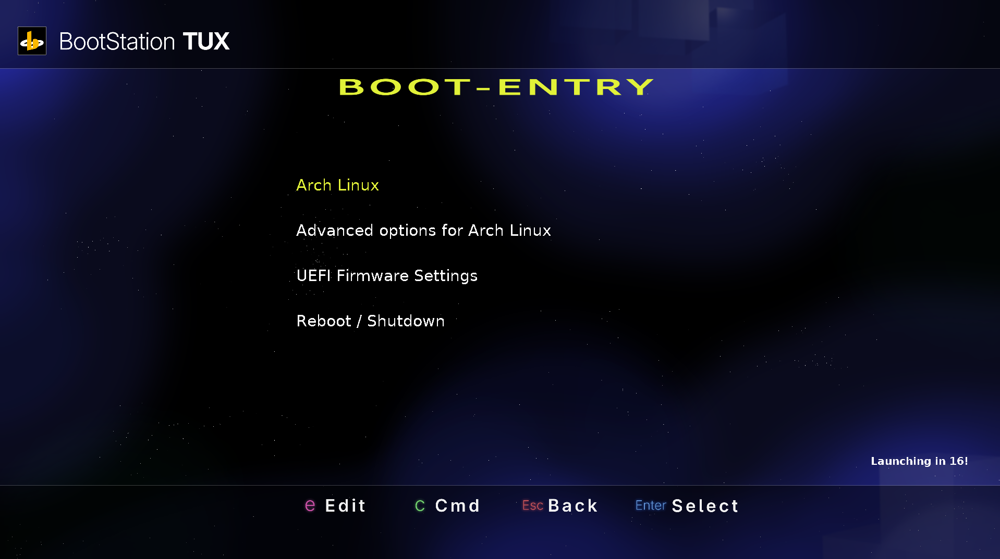

# bootStation TUX
bootStation TUX (Terminal Unleashed eXperimental, sensibly named) is a GRUB2 theme made to resemble the PlayStation 2 BroadBand Navigator released in 2002 in Japan.

Available for the following resolutions:
- 3840x2160
- 2560x1440
- 1920x1200
- 1920x1080

>800x600 mode might be added eventually for maximum crust. 
>Scrollbar functionality is not supported
